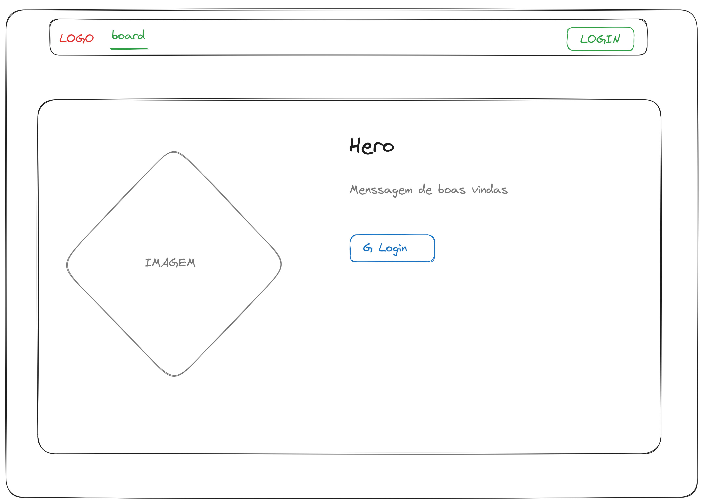
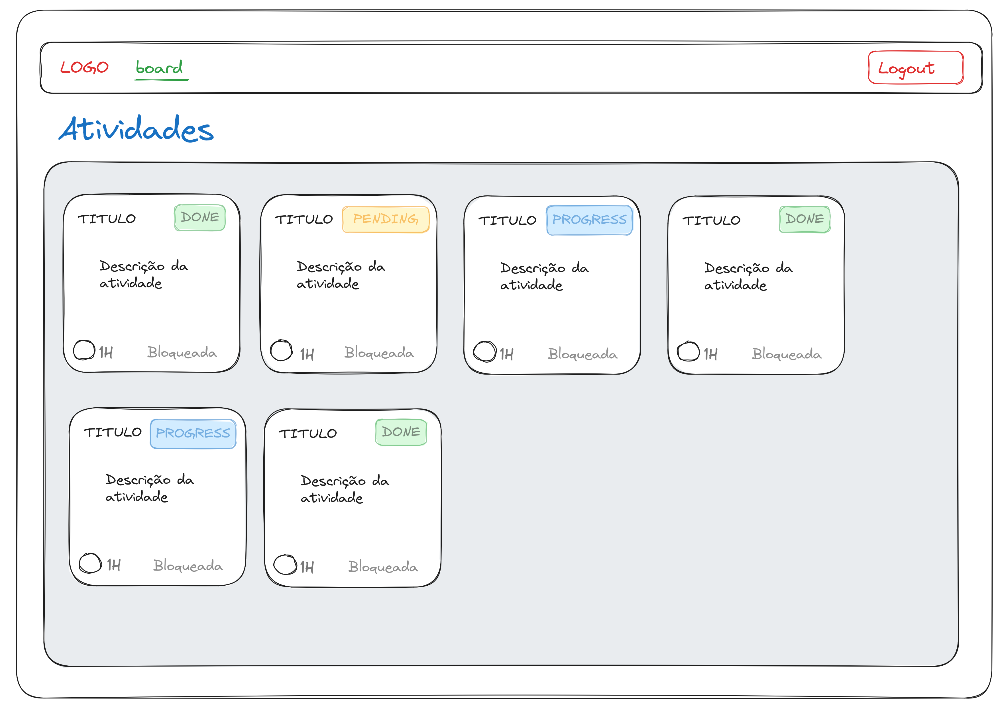
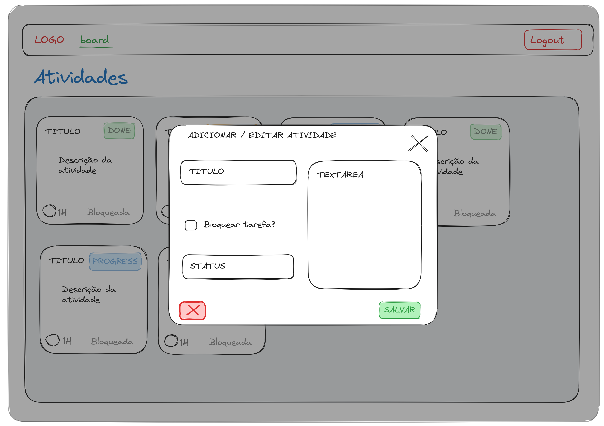

# fireTask

Exemplo de aplicação colaborativa para distribuir e gerenciais tarefas.

STACK:
* ReactJS com Typescript
  * Vite como bundler
  * StichesJS + Bootstrap para prototipagem rápida
  * Vitest para testes unitários
* Firebase
  * Firestore
  * Authentication
  * Hosting


## Como rodar

``` 
cd frontend
yarn install # para instalar dependencias
yarn dev
```


## Como buildar

```
cd frontend
yarn install # para instalar dependencias
yarn build
```

## Unit Tests

```
cd frontend
yarn install # para instalar dependencias
yarn test
```

[frontend/src/pages/Home/tests/Home.spec.tsx](frontend/src/pages/Home/tests/Home.spec.tsx)

[frontend/src/components/Header/tests/Header.spec.tsx](frontend/src/components/Header/tests/Header.spec.tsx)

[frontend/src/components/NewTaskForm/tests/NewTaskForm.spec.tsx](frontend/src/components/NewTaskForm/tests/NewTaskForm.spec.tsx)

[frontend/src/components/EditTaskForm/tests/EditTaskForm.spec.tsx](frontend/src/components/EditTaskForm/tests/EditTaskForm.spec.tsx)

[frontend/src/pages/BoardPage/tests/BoardPage.spec.tsx](frontend/src/pages/BoardPage/tests/BoardPage.spec.tsx)

Também foram criados scripts para utilização de emulador do firebase com concurrently e wait-on para testes de integração, porém não foram implementados.

```
cd frontend
yarn test:with-emulators 
```


## Descrição da aplicação

### Requisitos funcionais

- [x] Login com Google utilizando Firebase Authentication
- [x] Tarefas
  - [x] Usuário poder visualizar tarefas da board
  - [x] Usuário poder criar tarefas
  - [x] Usuário poder editar tarefas
    - [x] Usuário pode alterar o status da tarefa
    - [x] Dono da tarefa pode travar a tarefa para edição
    - [x] Outros usuários não podem editar tarefas travadas
  - [x] Usuário poder excluir tarefas
  - [x] Usuário pode filtrar tarefas por texto (título ou descrição)
- [x] Possivel visualizar usuários online em tempo real
- [x] Board é atualizada em tempo real para todos os usuários

### Requisitos não funcionais

- [x] Utilização de testes unitários nos componentes
  - [-] Emular firebase para testes de integração
- [x] Utilização de CSS responsivo
- [x] Utilização de Typescript
- [x] Banco de dados escalável
- [x] Utilização de protocolo HTTPS em produção
- [x] Hospedagem em nuvem
- [x] Utilização de CI/CD para execução de testes e deploy em produção


### Estrutura

#### Alguns rabiscos feitos em guardanapo por falta de tempo

* Tela Inicial



* Board de Atividades



* Adicionar/Editar Task

